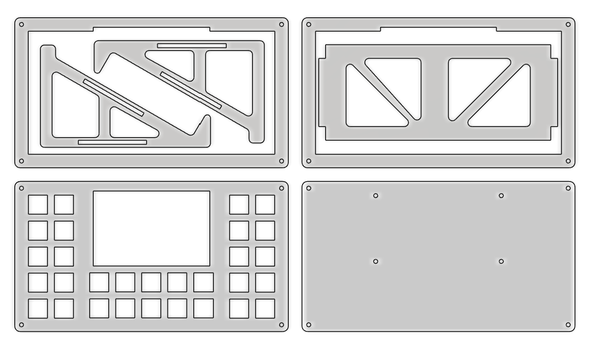

# Welcome to JDEK
## An open source macropad with   30 buttons and programmable 3.5 inch touch lcd display

## There are two main folders for Code and CAD files.

### CAD PART
CAD files were created in Fusion and are intended to be laser cut.

I hade 3mm clear acrylic sheet in mind when designing.

If you want thicker you will need to thicken the slots in the stand base 
or just cut thicker face and base plates and 3mm mid plates. 

For one jdek cut - 
>    1x face_plate,
>    1x base_plate,
>    6x mid_plate_stand_conn,
>    3x mid_plate_stand_base.

This also gives extra 2 stands but you will need extra mid plates for height. 

If you dont want extra stands then use "mid_plate_alone".

### CODE PART

As For the Code part you can follow this [Youtube tutorial](https://www.youtube.com/watch?v=OpIwI28cHpk) by Dustin Watts.
Just use the `User_Setup.h` provided or you can easy change the pin layout.

The mechanical switchs are controlled by Core0 on the rp2040 and its code recides in the first half of the ino file.

The LCD screen and touch part is handled by Core1 on the rp2040 so both the inputs works seamlessly together.
Also the functions and key binds for each key on the lcd can be changed in the second half of the ino file.

For the gifs some are preloaded in the `gifs` folder, with the program to make your own, (I dont know if I am allowed to 
share the program but I downloaded it for free so i dont think it will be an issue).

## Finished Look with my setup

### PCB Section (⚠️Warning⚠️ Not Checked)

You can find the source files and gerber files in PCB folder but be warned,
As I have not printed the PCB as it was expensive and went the route of hand wiring everything.

 

  
 
