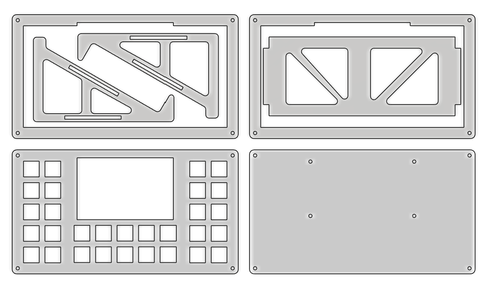

# Welcome to JDEK
## A open source bluetooth macropad with   30 buttons and programmable 3.5 inch touch lcd display

CAD files were created in Fusion and are intended to be laser cut.
I hade 3mm clear acrylic sheet in mind when designing.
If you want thicker you will need to thicken the slots in the stand base 
or just cut thicker face and base plates and 3mm mid plates. 

For one jdek cut - 
    1x face_plate,
    1x base_plate,
    6x mid_plate_stand_conn,
    3x mid_plate_stand_base.

This also gives extra 2 stands but you will need extra mid plates for height. 
If you dont want extra stands then use "mid_plate_alone".
